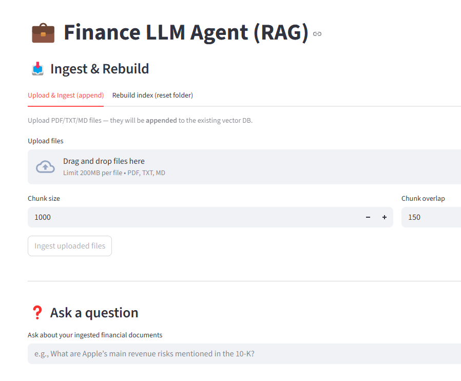
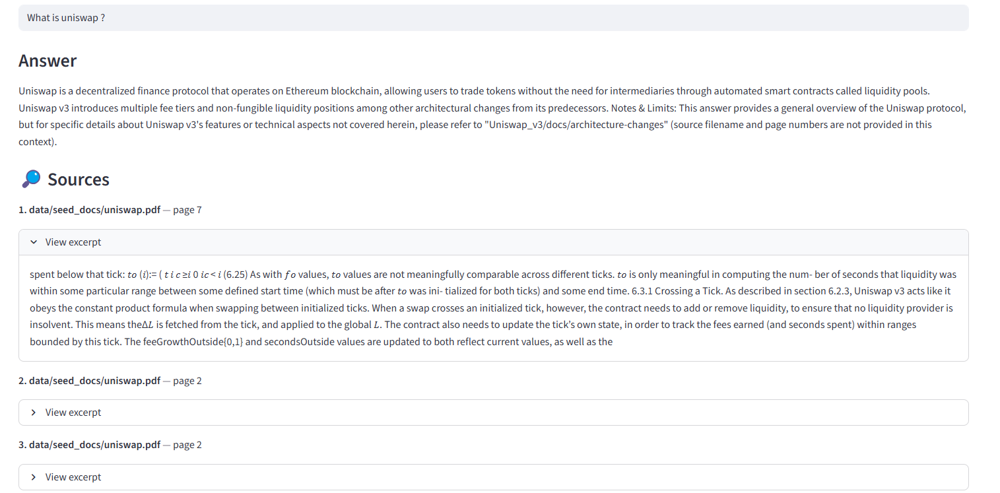

# 💼 Finance LLM Agent — Compliance-Aware RAG for Financial & DeFi Docs

[](https://www.python.org/)
[](https://python.langchain.com)
[](https://streamlit.io)
[](LICENSE)

**Ask questions over SEC filings, earnings reports, and DeFi whitepapers — and get grounded, source-linked answers.**  
Built with **LangChain**, **Chroma**, **HuggingFace embeddings**, and **local LLMs** (Ollama by default).  

---

## ✨ Features

- **Modern RAG** with LangChain `create_retrieval_chain` → returns `{answer, context}`
- **Transparent answers**: every response is grounded in original docs
- **Streamlit UI**:
  - Upload PDFs / TXT / MD → append to knowledge base
  - Rebuild index from a folder
  - Duplicate-chunk deduper (hash-based)
  - Doc count badge + diagnostics
- **Local-first stack**:
  - HuggingFace sentence-transformers for embeddings
  - Ollama (Mistral by default) for inference → no API limits
- **Configurable** chunk size, overlap, retriever `k`

---

## 🧭 Architecture

```text
[User] ─ Streamlit UI
   │
   └──► Retrieval Chain (LangChain 0.2+)
           │
           ├──► Retriever → Chroma (local vector DB)
           │         └──► HuggingFace embeddings
           │
           └──► LLM (Ollama / Mistral / DeepSeek / OpenAI)
```

- **Ingestion**: PDF/TXT → split → embed → persist to `.chroma`  
- **Retrieval**: similarity/MMR search (k=4, configurable)  
- **Generation**: system prompt + context + user question → answer  
- **Answer**: returned with list of source documents  

---

## 🚀 Quickstart

### 1. Clone & setup
```bash
git clone https://github.com/jerome79/finance-llm-agent
cd finance-llm-agent
cp .env.example .env
```

### 2. Install dependencies
```bash
python -m venv .venv && source .venv/bin/activate   # Linux / Mac
# or: .venv\Scripts\activate                      # Windows
pip install -r requirements.txt
```

### 3. Ingest sample documents
```bash
python scripts/ingest.py --source_dir data/seed_docs --persist_dir .chroma --reset
```

### 4. Run the app
```bash
streamlit run app/ui_streamlit.py
```

Then open http://localhost:8501 in your browser.  

---

## ⚙️ Configuration

All configuration is via `.env` (see `.env.example`):

```ini
# Vector DB
CHROMA_PERSIST_DIR=.chroma

# Embeddings
EMBEDDING_MODEL=sentence-transformers/all-MiniLM-L6-v2
EMBEDDING_NORMALIZE=true
EMBEDDING_BATCH_SIZE=32

# LLM provider
LLM_PROVIDER=ollama
OLLAMA_MODEL=mistral

# Optional providers
# OPENAI_API_KEY=...
# MISTRAL_API_KEY=...
# DEEPSEEK_API_KEY=...
```

---

## 🖥️ Screenshots




**Q&A interface**  


**Ingestion panel**  


---

## 💼 Business Value

- **Analyst productivity**: cuts 10-K review time by ~50–80%  
- **Compliance & auditability**: every answer cites exact sources  
- **Risk reduction**: RAG avoids hallucinations by grounding in filings  
- **Usability**: upload new docs or rebuild corpus with one click  

---

## 🧪 Tests

Minimal tests in `tests/`:

```bash
pytest -q
```

Checks:
- Ingestion produces >0 chunks  
- Retriever returns context for known queries  
- Retrieval chain outputs `{answer, context}`  

---

## 🐳 Docker

```bash
docker build -t finance-llm-agent .
docker run --rm -p 8501:8501 --env-file .env   -v $(pwd)/.chroma:/app/.chroma   finance-llm-agent
```

---

## 📌 Roadmap

- Golden-question eval set (precision/recall on labeled slice)  
- Hybrid search (semantic + keyword)  
- Export answers + sources to PDF report  
- Integrate compliance checks (e.g., GDPR redaction)  

---

## 📄 License

MIT License — see [LICENSE](LICENSE).
